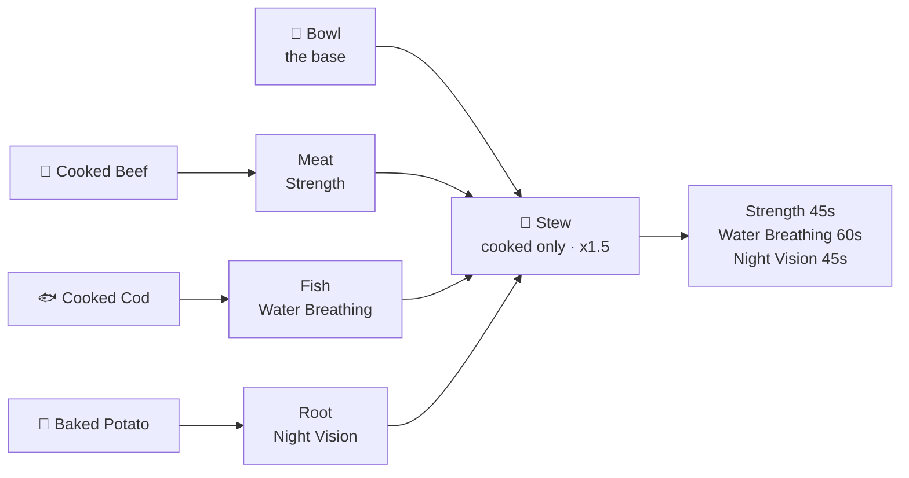

<div align="center">

# Overhaul

### Several mods in one. None of them hardcoded.

*A modular Fabric mod for Minecraft **26.2** — food, backpacks, magic, mobs and inventory.*
*Switch any of it off. Retune all of it from JSON.*

<br/>

[](https://www.minecraft.net/)
[](https://fabricmc.net/)
[](https://openjdk.org/)
[](LICENSE)

**[📖 Read the Wiki](https://github.com/Nexiimil/Overhaul/wiki)** ·
[Getting Started](https://github.com/Nexiimil/Overhaul/wiki/Getting-Started) ·
[Configuration](https://github.com/Nexiimil/Overhaul/wiki/Configuration) ·
[Config Reference](https://github.com/Nexiimil/Overhaul/wiki/Config-Reference)

</div>

<br/>

---

## The modules

<table>
<tr>
<td width="50%" valign="top">

### 🍅 Tasty

**Four crops, seventeen items, six meals.**

Put a bowl and a handful of ingredients anywhere in a crafting grid. No fixed shape — the recipe
reads what you gave it and builds the meal from it.

Eating plain food just feeds you. **Effects only come from meals**, and you can predict what a meal
does before you make it.

**[→ Tasty Module](https://github.com/Nexiimil/Overhaul/wiki/Tasty-Module)**

</td>
<td width="50%" valign="top">

### 🎒 Backpack

**Six tiers, from 9 slots to 54.**

Leather, string and a chest gets you the first one. Every tier after that is a smithing upgrade — so
the bag keeps its contents when you upgrade it.

Carry more than three loaded bags and you get **Slowness and Mining Fatigue**, which is what makes
one bigger bag the answer instead of six small ones.

**[→ Backpack Module](https://github.com/Nexiimil/Overhaul/wiki/Backpack-Module)**

</td>
</tr>
<tr>
<td width="50%" valign="top">

### 📖 Magical

**Enchanted gear you keep.**

*"Too Expensive!"* is gone, and so is the prior-work penalty that quietly turns every good tool into
a consumable. Repairs cost **more material** instead, scaled to how enchanted the item is.

Bookshelves start empty and hold books you put in them — so an enchanting setup is something you
stock, not a wall you build.

**[→ Magical Module](https://github.com/Nexiimil/Overhaul/wiki/Magical-Module)**

</td>
<td width="50%" valign="top">

### 💀 Mob

**A horde that stays a horde.**

Mobs belong to factions — Overworld, Nether, Ender, Illager — and will not damage or target their
own. A vanilla horde defuses itself the moment a skeleton clips a creeper. This one doesn't.

And on a bad night one comes for you: a **horde** drawn from a single faction, gated on the local
difficulty that rises in the chunks you actually live in.

Zombies vary in speed and call for help. Skeletons open fire from 26 blocks. Endermen rearrange your
builds. Anything badly wounded runs.

**[→ Mob Module](https://github.com/Nexiimil/Overhaul/wiki/Mob-Module)**

</td>
</tr>
<tr>
<td colspan="2" valign="top">

### 🧰 Inventory

**Quick-stacking, sorting, locked slots and a bin.**

Press one key and every stack you are carrying goes to the chest that **already holds it** — not the
nearest one, not the first with space. A chest becomes a filing destination by having something filed
in it once, so there is nothing to set up per chest.

Sort any container by name or by mod, filling rows or columns. Lock the slots you want left alone.
Bin something into a slot that **holds the last thing you binned**, so a misclick is recoverable.
Open a shulker box straight from your hand.

No items, no blocks — buttons, two keys and a slot.

**[→ Inventory Module](https://github.com/Nexiimil/Overhaul/wiki/Inventory-Module)**

</td>
</tr>
</table>

---

## One rule, eleven families

Every ingredient belongs to a family. Every family has exactly one effect. That's the whole system —
learnable in one sitting, and it holds for modded food too, because anything unlisted falls back to
the conventional `c:foods/*` tags.



Cooking an ingredient doubles what it contributes. A golden one triples it and adds a level. Repeat
the same ingredient and each copy is worth half the last — so five different things beat five steaks,
and four distinct ingredients earn a bonus level on everything.

**[→ Meals and Flavours](https://github.com/Nexiimil/Overhaul/wiki/Meals-and-Flavours)** for the full
table and the maths.

---

## Nothing is hardcoded

Everything lives in `config/overhaul/`, written on first launch.

```
config/overhaul/
├── overhaul.json   which modules are enabled
├── tasty.json      foods, crops, meals, flavour families
├── backpack.json   tiers, sizes, the upgrade ladder
├── magical.json    anvil rules, bookshelf behaviour
├── mob.json        factions, per-mob tuning
└── inventory.json  quick-stacking, sorting, locked slots, the bin
```

> **Recipes are real recipes.** Every recipe in the config is a thin mirror of the vanilla recipe
> JSON, and Overhaul generates a data pack from it at startup. Change a `type` from `crafting_shaped`
> to `smelting` and you get a genuine smelting recipe — anything vanilla can express, the config can
> express.

> **Adding entries works, not just editing them.** The `foods`, `crops`, `meals`, `tiers` and
> `teams.members` maps register whatever is in them. A pack can add its own food with its own recipe
> and effects, and the only thing it needs from outside the config is a texture.

**[→ Configuration](https://github.com/Nexiimil/Overhaul/wiki/Configuration)** ·
**[→ Config Reference](https://github.com/Nexiimil/Overhaul/wiki/Config-Reference)**

---

## Install

| | |
| --- | --- |
| **Minecraft** | 26.2 |
| **Fabric Loader** | 0.19.0+ |
| **Java** | 25+ |
| **Requires** | Fabric API |

Drop Fabric API and Overhaul into `mods/`, launch once, and the config appears.
Works on clients and dedicated servers — needed on both.

**[→ Getting Started](https://github.com/Nexiimil/Overhaul/wiki/Getting-Started)**

## Build

```sh
./gradlew build              # jar lands in build/libs/
./gradlew runClient          # play the mod in a dev client
./gradlew runServer          # dev dedicated server
./gradlew runClientGameTest  # a real client, launched by Gradle, asserting against a live world
```

Needs JDK 25 — Gradle will download one if you don't have it.

**[→ Building and Testing](https://github.com/Nexiimil/Overhaul/wiki/Building-and-Testing)** ·
**[→ Architecture](https://github.com/Nexiimil/Overhaul/wiki/Architecture)**

---

<div align="center">

**[📖 Wiki](https://github.com/Nexiimil/Overhaul/wiki)** ·
[FAQ](https://github.com/Nexiimil/Overhaul/wiki/FAQ) ·
[Compatibility](https://github.com/Nexiimil/Overhaul/wiki/Compatibility) ·
[Issues](https://github.com/Nexiimil/Overhaul/issues)

MIT licensed.

</div>
